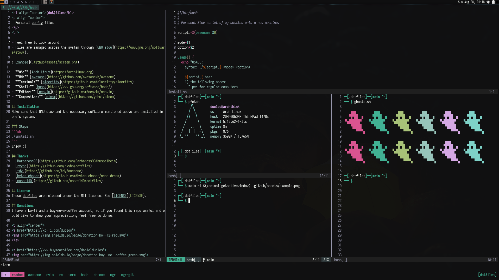

<h1 align="center">(dot)files</h1>
<p align="center">
  Personal config files
</p>
<br>

- Feel free to look around.
- Files are managed across the system through [GNU stow](https://www.gnu.org/software/stow/).



- **OS:** [Arch Linux](https://archlinux.org)
- **WM:** [awesome](https://github.com/awesomeWM/awesome)
- **Terminal:** [alacritty](https://github.com/alacritty/alacritty)
- **Shell:** [bash](https://www.gnu.org/software/bash/)
- **Editor:** [neovim](https://github.com/neovim/neovim)
- **Compositor:** [picom](https://github.com/yshui/picom)

## Installation
Make sure that GNU stow and the necessary software mentioned above are installed in one's system.

### Steps
```sh
./install.sh
```
Enjoy :)

## Thanks
- [Barbaross93](https://github.com/Barbaross93/Muspelheim)
- [rxyhn](https://github.com/rxyhn/dotfiles)
- [tdy](https://github.com/tdy/awesome)
- [bytes-chaser](https://github.com/bytes-chaser/neon-dream)
- [manas140](https://github.com/manas140/dotfiles)
- [rklyz](https://github.com/rklyz/MyRice)
- [nuxshed](https://github.com/nuxshed/dotfiles)


## License
These dotfiles are released under the MIT license. See [LICENSE](LICENSE).

## Donations
I have a ko-fi and a buy-me-a-coffee account, so if you found this repo useful and would like to show your appreciation, feel free to do so!

<p align="center">
<a href="https://ko-fi.com/duclos">

</a>

<a href="https://www.buymeacoffee.com/danielduclos">

</a>

</p>

---
<p align="center">
<a href="https://github.com/duclos-cavalcanti/templates/LICENSE">
  
</a>
<a>
  
</a>
<a>
  
</a>

</p>
