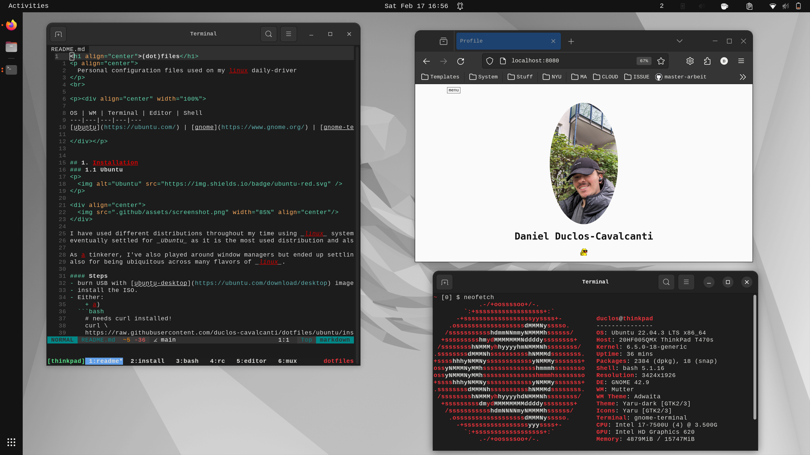

<h1 align="center">(dot)files</h1>
<p align="center">
  Personal configuration files used on my linux daily-driver 
</p>
<br>

<p><div align="center" width="100%">

OS | WM | Terminal | Editor | Shell
---|---|---|---|---
[ubuntu](https://ubuntu.com/) | [gnome](https://www.gnome.org/) | [gnome-terminal](https://en.wikipedia.org/wiki/GNOME_Terminal)/[tmux](https://github.com/tmux/tmux/wiki) | [neovim](https://github.com/neovim/neovim) | [bash](https://www.gnu.org/software/bash/)

</div></p>


## 1. Installation

<div align="center">
  
</div>

<!-- <p> -->
<!--    -->
<!-- </p> -->

I have used different distributions throughout my time using `Linux` systems, from _Manjaro_,  to _Arch Linux_ and 
finally _Ubuntu_. As someone who loves tinkering, I've also played around window managers but ended up settling 
for [Gnome](https://www.gnome.org/) for its simplicity and ubiquity.

#### Steps
- burn USB with [ubuntu-desktop](https://ubuntu.com/download/desktop) image.
- install the ISO.
- Run either:
    + a) 
  ```bash
    # needs curl installed!
    curl \
    https://raw.githubusercontent.com/duclos-cavalcanti/dotfiles/ubuntu/install.sh | bash
  ```

    + b)
  ```bash
    git clone https://github.com/duclos-cavalcanti/dotfiles/ $HOME/.dotfiles
    cd .dotfiles
    ./install.sh
  ```

Output:

<div align="center">
  
</div>

## 2. License
These dotfiles are released under the MIT license. See [LICENSE](LICENSE).

## 3. Donations
I have a ko-fi and a buy-me-a-coffee account, so if you found this repo useful and would like to show your appreciation, feel free to do so!

<p align="center">
<a href="https://ko-fi.com/duclos">

</a>

<a href="https://www.buymeacoffee.com/danielduclos">

</a>

</p>

---
<p align="center">
<a href="https://github.com/duclos-cavalcanti/templates/LICENSE">
  
</a>
<a>
  
</a>
<a>
  
</a>
</p>
