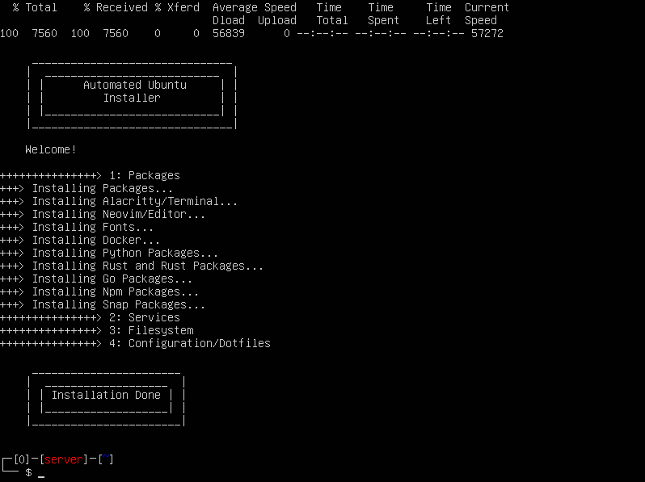

<h1 align="center">(dot)files</h1>
<p align="center">
  Personal config files used on my linux daily-driver 
</p>
<br>

<div align="center" width="100%">

OS | WM | Terminal | Editor | Shell
---|---|---|---|---
[nixos/](https://nixos.org/)[ubuntu](https://ubuntu.com/) | [awesome](https://github.com/awesomeWM/awesome) + [picom](https://github.com/yshui/picom) + [wallpapers](https://github.com/ubuntu-mate/ubuntu-mate-artwork) | [wezterm](https://github.com/wez/wezterm) | [neovim](https://github.com/neovim/neovim) | [bash](https://www.gnu.org/software/bash/)

</div>


## Deployment
* For full installation, go [here](#install).
* To simply stow the dotfiles, first install `stow` and run:
  ```sh
  ./install.sh -s
  ```

<a name="install"/>

## Installation
### NixOS
<p>
  
</p>

A linux distribution based on the [nix](https://nixos.org/) package manager, who enables a __declarative__ and __reproducible__ 
build system. When the system is built, a configuration file is generated which states every aspect of the operating 
system.

#### Steps

0. Burn USB with [nix-os](https://nixos.org/) image.
1. Set keyboard layout.
```sh
setxkbmap us
```

2. Partition filesystem.
```sh
# example: 
sudo parted /dev/sda
# Launches parted

# Create a GPT partition table
mklabel gpt

# Create the EFI System Partition (ESP)
mkpart ESP fat32 1MiB 512MiB
set 1 esp on
name 1 EFI

# Create the root partition
mkpart primary ext4 512MiB -8GiB
name 2 root

# Create a swap partition
mkpart primary linux-swap -8GiB 100%
name 3 swap

quit
# Exits parted

sudo mkfs.fat -F32 -n EFI /dev/sda1
sudo mkfs.ext4 -L root /dev/sda2
sudo mkswap /dev/sda3
sudo swapon /dev/sda3

mount -L root /mnt

mkdir -p /mnt/boot/efi
mount -L EFI /mnt/boot/efi
```

3. Run
```sh
nix run github:duclos-cavalcanti/dotfiles
```

### Ubuntu __(deprecated)__
<p>
  
</p>

<div align="center">
  
</div>

#### Steps
- burn USB with [ubuntu-server](https://www.releases.ubuntu.com/jammy/) image
- Run: 
  ```bash
  curl \
  https://raw.githubusercontent.com/duclos-cavalcanti/dotfiles/ubuntu/bootstrap.sh | bash
  ```

<div align="center">
  
</div>

To avoid the annoying cloud-init output pollution as per this 
[issue](https://askubuntu.com/questions/1333240/ubuntu-20-04-server-blocks-at-boot-cloud-init-and-login),
simply create the `/etc/cloud/cloud-init.disabled` file afterwards.


## License
These dotfiles are released under the MIT license. See [LICENSE](LICENSE).

## Donations
I have a ko-fi and a buy-me-a-coffee account, so if you found this repo useful and would like to show your appreciation, feel free to do so!

<p align="center">
<a href="https://ko-fi.com/duclos">

</a>

<a href="https://www.buymeacoffee.com/danielduclos">

</a>

</p>

---
<p align="center">
<a href="https://github.com/duclos-cavalcanti/templates/LICENSE">
  
</a>
<a>
  
</a>
<a>
  
</a>
</p>
