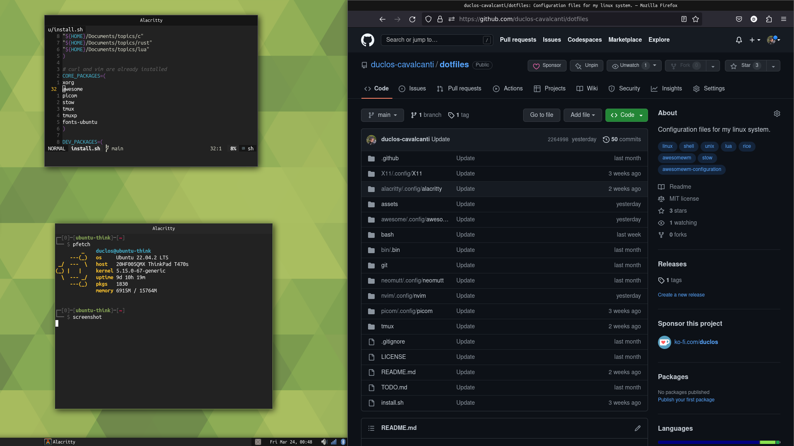

<h1 align="center">(dot)files</h1>
<p align="center">
  Personal config files used on my linux daily-driver 
</p>
<br>

<p><div align="center" width="100%">

OS | WM | Terminal | Editor | Shell
---|---|---|---|---
[ubuntu](https://ubuntu.com/) | [openbox](http://openbox.org/wiki/Help:Getting_started)/[tint2](https://gitlab.com/o9000/tint2) | [xterm](https://invisible-island.net/xterm/)/[tmux](https://github.com/tmux/tmux/wiki) | [neovim](https://github.com/neovim/neovim) | [bash](https://www.gnu.org/software/bash/)

</div></p>


## 1. Installation
### 1.1 Ubuntu 
<p>
  
</p>

<div align="center">
  
</div>

I have used several different distributions throughout my time daily driving 
linux. Those

Previously I've used _Arch Linux_ with several different window managers.
Eventually, ended up on Ubuntu with _Openbox_. I felt it utilizes configurable and non-changing _dotfiles_ that 
bring a consistency and flexibility to one's workflow, as well as is the easiest setup to maintain. Both Ubuntu 
and Openbox are long-standing projects, that don't seem to be going anywhere. In addition to that, utilizing a ditribution 
that is pretty much a standard or expected across the industry is helpful. 

#### Steps
- burn USB with [ubuntu-desktop](https://ubuntu.com/download/desktop) image.
- install the ISO.
- Either:
    + a) 
  ```bash
    # needs curl installed!
    curl \
    https://raw.githubusercontent.com/duclos-cavalcanti/dotfiles/ubuntu/install.sh | bash
  ```

    + b)
  ```bash
    git clone https://github.com/duclos-cavalcanti/dotfiles/ $HOME/.dotfiles
    cd .dotfiles
    ./install.sh
    # only if you want my intel/xorg configurations
    sudo make root
  ```

Output:

<div align="center">
  
</div>

### 1.2 NixOS  _(WIP)_

<details closed>
<summary>
click
</summary>
<p>

<p>
  
</p>

A linux distribution based on the [nix](https://nixos.org/) package manager, who enables a __declarative__ and __reproducible__ 
build system. When the system is built, a configuration file is generated which states every aspect of the operating 
system. It is a very powerful system, enables easy self-packaging of projects, sandboxed environments, infrastructure as code 
to define multiple systems, and so many more. It is my system of choice and the steps below are to be done in case 
you would like to try my system out!

#### Steps

0. Burn USB with [nix-os](https://nixos.org/) image.
1. Connect to WiFi if needed. [_(Example)_](https://gist.github.com/duclos-cavalcanti/07a35299de7e095052562ea9ef492b6d)
2. Partition filesystem. [_(Example)_](https://gist.github.com/duclos-cavalcanti/e78ea4c665cdd3bb814b6fb57db68dc4)
3. Run
```sh
nix --experimental-features 'nix-command flakes' run github:duclos-cavalcanti/dotfiles#flake
```


</p>
</details>

## 2. License
These dotfiles are released under the MIT license. See [LICENSE](LICENSE).

## 3. Donations
I have a ko-fi and a buy-me-a-coffee account, so if you found this repo useful and would like to show your appreciation, feel free to do so!

<p align="center">
<a href="https://ko-fi.com/duclos">

</a>

<a href="https://www.buymeacoffee.com/danielduclos">

</a>

</p>

---
<p align="center">
<a href="https://github.com/duclos-cavalcanti/templates/LICENSE">
  
</a>
<a>
  
</a>
<a>
  
</a>
</p>
